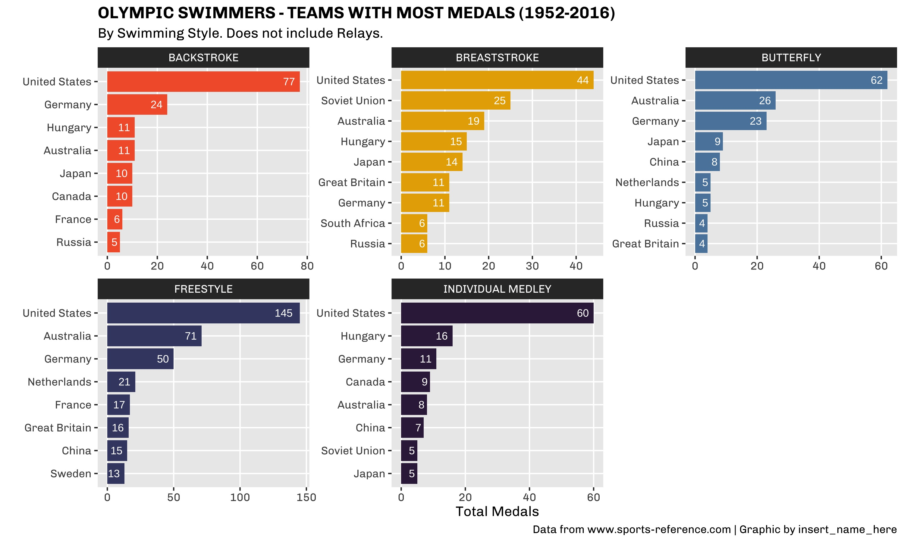
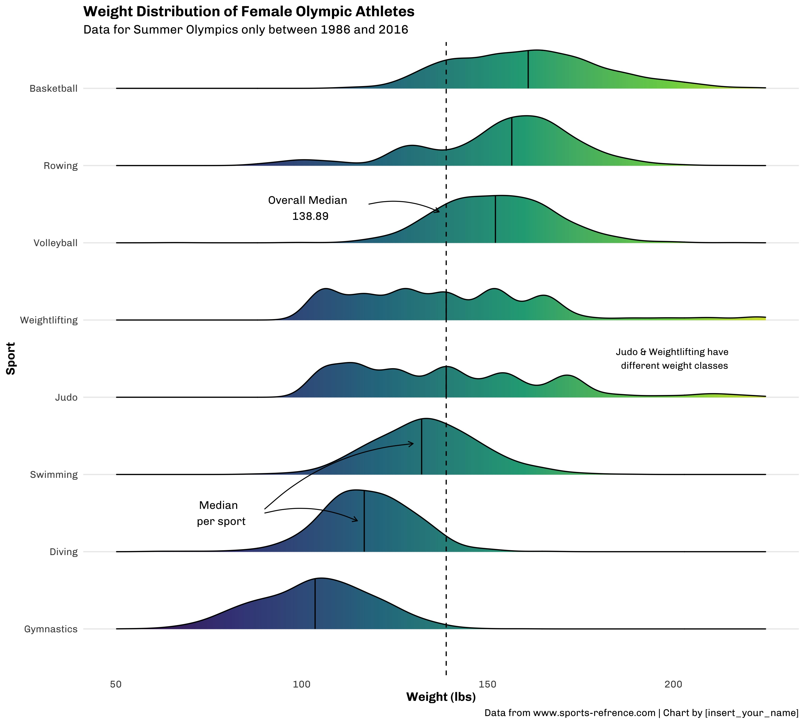

# Workshops

## Women Who Code Data Science

I collaborated with the amazing team at WWC Data Science to put together a workshop on creating visualizations in R. The workshop was geared to first-time users and ranged from covering basic R concepts to specific functions for tidyverse packages, such as dplyr and ggplot2. By the end of the session, participants created two visualizations - a faceted bar plot and a density plot.

## Resources
- [Workshop Recording](https://www.youtube.com/watch?v=KZbc091mybE)
- [Workshop Slides](slides)
- [Workshop Code Notebook](code/wwc_workshop.R)
- [Olympics Dataset](https://github.com/rfordatascience/tidytuesday/blob/master/data/2021/2021-07-27/readme.md)

## Plots

### Faceted Bar Plot

### Density Plot

